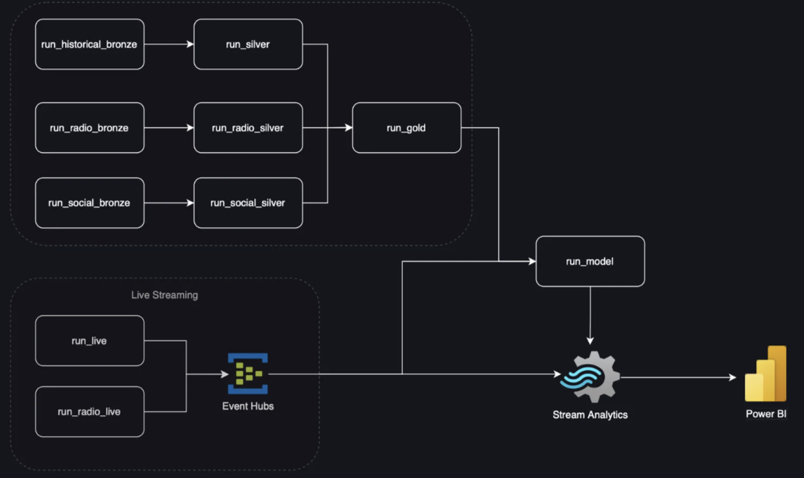

# Formula 1 Race Analytics Platform

**DS591 — Big Data Workloads, Boston University**

A full-stack Formula 1 analytics platform that combines historical race telemetry, team radio communications, and social media sentiment into a predictive model for race position. The system supports both historical batch processing and real-time live race streaming.

---

## Architecture Overview



The platform is built on Azure and follows a **Medallion architecture** (Bronze → Silver → Gold → Platinum) with four parallel data pipelines feeding a single predictive model.

```
FastF1 / OpenF1 API
        │
    [Bronze]  ←── Raw telemetry, lap data, weather, radio recordings, social media posts
        │
    [Silver]  ←── Cleaned, aligned, and classified data
        │
    [Gold]    ←── Driver-specific model-ready features + social/radio signals merged
        │
  [Platinum]  ←── Trained model weights (Bi-LSTM per driver + Random Forest)
```

**Live race path:**
```
F1 Live Timing Feed → Azure Event Hub → Azure Stream Analytics → Power BI
```

---

## Pipelines

### Historical Analysis
Processes 2024–2025 race sessions using FastF1. Extracts driver telemetry (speed, gear, RPM, DRS, brake, position, coordinates), lap data (tyre compound, tyre life, lap number, track status), and weather. Silver merges these via time-based joins. Gold builds per-driver feature sets including the driver ahead, driver behind, gap distances, and one-hot encoded categoricals.

See [`documents/History_Analysis.md`](documents/History_Analysis.md) for details.

### Live Casting
Streams real-time lap data to Azure Event Hub during an active race using a three-thread architecture: one thread records the F1 timing feed, one polls every 5 seconds and pushes a full 20-driver grid snapshot, and one runs model inference every ~90 seconds (one lap). Feeds a live Power BI dashboard.

See [`documents/Live_casting.md`](documents/Live_casting.md) for details.

### Team Radio
Fetches raw MP3 recordings from the OpenF1 API (Bronze), transcribes them offline via OpenAI Whisper, then classifies each transmission into 12 event types (pit call, tyre strategy, pace management, safety, weather, damage, mechanical, overtaking, defending, traffic, celebration, information) using keyword pattern matching. Produces per-driver, per-session feature counts merged into Gold.

See [`documents/Radio_Data.md`](documents/Radio_Data.md) for details.

### Social Media Analysis
Processes scraped driver social media posts. Scores each post using TextBlob sentiment (70%) and log-scaled likes engagement (30%) into a 1–10 `life_score`. Aggregates to a per-driver, per-month mean and merges into Gold as `social_life_score`.

See [`documents/Social_Analysis.md`](documents/Social_Analysis.md) for details.

---

## Predictive Model

A two-stage model trained on Gold data:

1. **Bi-LSTM channel per driver** — takes 30-second windows of telemetry (300 timesteps at 0.1s resolution) and produces a 32-dimensional embedding.
2. **Random Forest aggregator** — trained on embeddings from all driver channels to predict race position 5 minutes ahead.

Social score and radio availability are used as attention signals, not raw LSTM features. Model artifacts are saved to the `platinum/models/` container on ADLS.

---

## Azure Function Endpoints

All endpoints are defined in `function_app.py`.

| Endpoint | Method | Description |
|---|---|---|
| `/api/run_live` | POST | Start live race pipeline (blocks ~2h) |
| `/api/run_silver` | POST | Run historical silver processing |
| `/api/run_gold` | POST | Run historical gold feature engineering |
| `/api/run_model` | POST | Train Bi-LSTM + Random Forest |
| `/api/run_radio_bronze` | POST | Fetch raw radio from OpenF1 |
| `/api/run_radio_silver` | POST | Transcribe and classify radio |
| `/api/process_social` | POST | Run social media scoring |
| `/api/health` | GET | Health check |

**Full pipeline execution order:**
```
run_radio_bronze
        ↓
run_silver | run_radio_silver | process_social  (parallel)
        ↓
    run_gold
        ↓
    run_model
```

---

## Setup

### Prerequisites

- Python 3.10+
- [Azure Functions Core Tools](https://learn.microsoft.com/en-us/azure/azure-functions/functions-run-local)
- Azure Storage Account (ADLS Gen2)
- Azure Event Hub namespace
- formula1.com account (for live timing)
- OpenF1 account (for live radio)

### Installation

```bash
git clone <repo-url>
cd ds591-Formula-1-Project

python -m venv .venv && source .venv/bin/activate
pip install -r requirements.txt

cp local.settings.json.template local.settings.json
# Fill in credentials in local.settings.json
```

### Environment Variables

| Variable | Description |
|---|---|
| `STORAGE_ACCOUNT_NAME` | Azure Storage account name |
| `STORAGE_ACCOUNT_KEY` | Azure Storage account key |
| `F1_USERNAME` | formula1.com email |
| `F1_PASSWORD` | formula1.com password |
| `EVENT_HUB_CONNECTION_STRING` | Azure Event Hub connection string |
| `EVENT_HUB_NAME` | Event Hub instance name |
| `AZURE_SPEECH_KEY` | Azure Speech Services key (live radio only) |
| `AZURE_SPEECH_REGION` | Azure Speech Services region (live radio only) |
| `F1_YEAR` | Target race year (e.g. `2026`) |
| `F1_GRAND_PRIX` | Target Grand Prix name (e.g. `Miami Grand Prix`) |
| `F1_SESSION_TYPE` | Session type — `R` for race, `Q` for qualifying |
| `YEARS` | Comma-separated years for historical processing (e.g. `2024,2025`) |
| `TARGET_DRIVER` | Driver abbreviation for Gold pipeline (default: `LEC`) |

### Running Locally

```bash
# Historical pipelines
python src/fetch_data.py       # Bronze ingestion
python src/silver.py           # Silver processing
python src/gold.py             # Gold feature engineering

# Live race pipeline (start 2–3 minutes before session begins)
python src/live_casting.py

# Azure Functions local server
func start
```

---

## Live Dashboard

<!-- Add Power BI dashboard link or screenshot here -->

---

## Data Sources

| Source | Used For |
|---|---|
| [FastF1](https://github.com/theOehrly/Fast-F1) | Historical telemetry, lap data, weather |
| [OpenF1 API](https://openf1.org) | Team radio recordings, live radio stream |
| Social media scraper (external) | Driver post captions and engagement counts |
